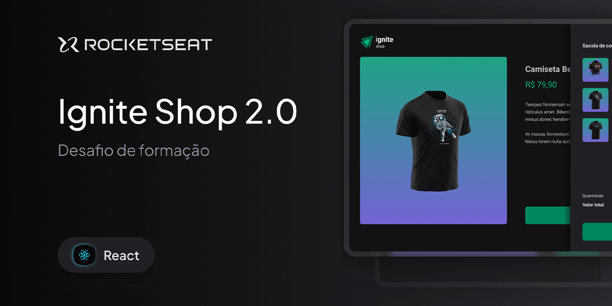

# Ignite Shop

<p align="center">
  
  
  
  
 
  
</p>

<p align="center">
  
</p>

## Descrição

O **Ignite Shop** é uma aplicação de marketplace completa integrada com a API do Stripe. Este projeto foi originalmente desenvolvido durante a trilha Ignite da Rocketseat e evoluído tecnicamente para as versões mais recentes das tecnologias.

O maior destaque deste projeto foi a **migração completa do Next.js 12 (Pages Router) para o Next.js 16 (App Router)**. Como o Stitches (utilizado originalmente) foi descontinuado, realizei a transição para **Styled Components**, implementando um Registro de Estilos (_Style Registry_) para garantir a compatibilidade com a renderização no servidor (SSR) e evitar o _layout shift_.

## 🚀 Tecnologias

- **Next.js 16** (App Router & Server Components)
- **React 19**
- **TypeScript**
- **Styled Components** (com implementação de Registry)
- **Stripe API** (Checkout & Webhooks)
- **Keen Slider** (Carrossel de produtos)

## Estrutura do Projeto

Abaixo, a organização de pastas focada em escalabilidade e separação de conceitos no App Router:

```text
app/
├── api/                # Route Handlers (Integração com Stripe)
├── product/[id]/       # Página dinâmica de produto (SSG)
├── success/            # Página de confirmação de compra (Server Side)
├── _assets/            # Recursos de imagem e logo
├── _components/        # Componentes compartilhados (BuyButton, etc.)
├── _contexts/          # Gerenciamento de estado (CartContext)
├── _lib/               # Configurações de bibliotecas (Stripe, SC Registry)
├── _services/          # Lógica de integração com serviços externos
├── _styles/            # Tema e Estilos Globais
│   ├── pages/          # Estilos específicos de cada página
│   ├── global.ts       # Reset e definições globais
│   └── theme.ts        # Design Tokens (Cores, Fontes)
├── layout.tsx          # Layout principal e Metadados
├── providers.tsx       # Wrapper de Providers de Cliente
└── page.tsx            # Home da aplicação (Landing de produtos)
public/                 # Favicons, Manifest e ativos estáticos
```

## Começar

**Pré-requisitos:**

- Node.js 24+ e npm/yarn/pnpm
- Conta no Stripe para obter as chaves de API.

**Instalação:**

```bash
npm install
```

**Configuração:** Crie um arquivo .env.local na raiz com as seguintes chaves:

```code
STRIPE_PUBLIC_KEY=sua_chave_publica
STRIPE_PRIVATE_KEY=sua_chave_privada
NEXT_URL=http://localhost:3000
```

Execução em desenvolvimento:

```bash
npm run dev
```

Abra http://localhost:3000 no navegador.

Build para produção:

```bash
npm run build
npm start
```

## Scripts úteis

- `npm run dev` — Executa em modo desenvolvedor com Turbopack.
- `npm run build` — Compila para produção validando tipos e lint.
- `npm run lint` — Executa a verificação do ESLint.
- `npm run format` — Formata o código com Prettier.

## Layout

Protótipo e especificações do layout estão disponíveis no Figma:

<a href="https://www.figma.com/community/file/1550129859653289562" target="_blank">
  
</a>

Abra o link para ver telas, fluxo e espaçamentos usados no projeto.

## Scripts úteis

- `npm run dev` — executa em modo desenvolvedor
- `npm run build` — compila para produção
- `npm start` — inicia o servidor de produção

## 📄 Licença

Este projeto está sob a licença MIT. Veja o arquivo LICENSE para mais detalhes.

---

Feito com 💜 por <a href="https://github.com/Robson16/">Robson H. Rodrigues</a>
